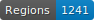
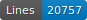
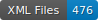

# HTR data for Henri Pirenne's Mahomet et Charlemagne

   

# Data

ALTO files with segmentation and transcription fully corrected manually.

## Licence

Transcriptions are open source, not the images which belong to Université Libre de Bruxelles.

## Citation

Carmen Carrasco Luján, _HTR data for Henri Pirenne's Mahomet et Charlemagne_, Université Libre de Bruxelles, 2025

